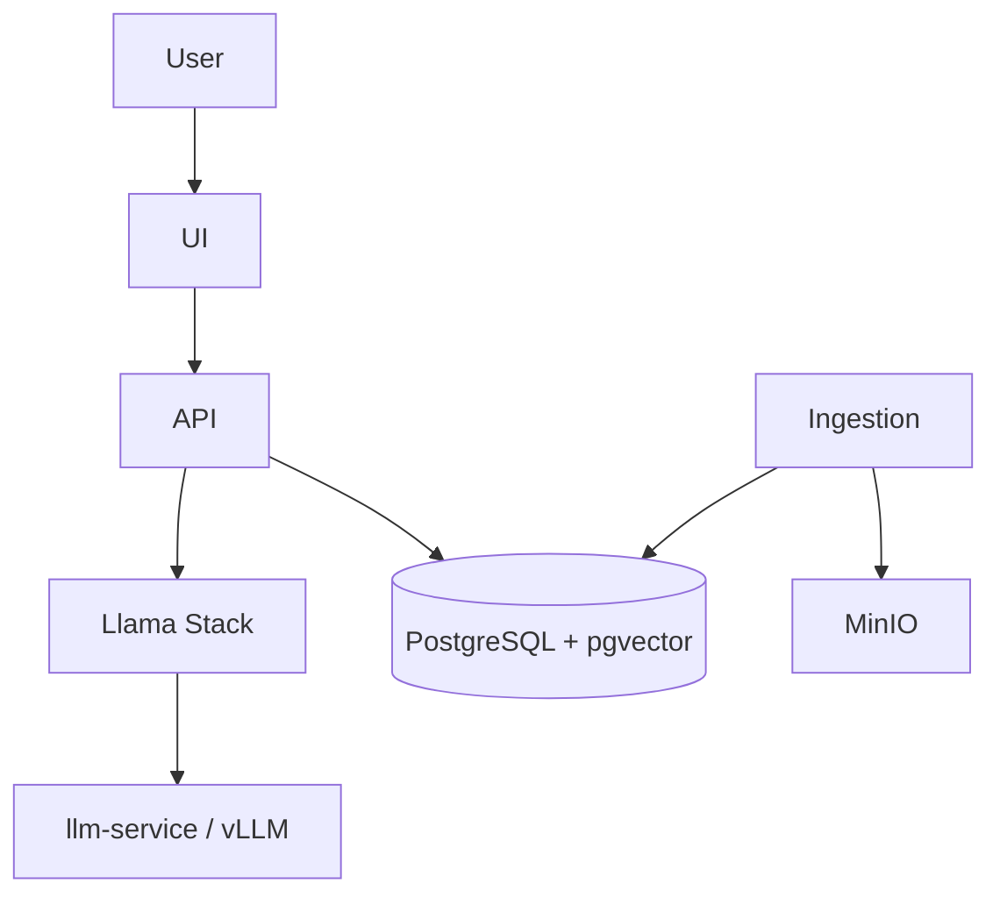

# Architecture diagram guide

Generate a Mermaid diagram during `rh-qs-architect` showing component relationships.

## What to include

- User → UI → API → PostgreSQL / pgvector
- API → Llama Stack → llm-service (if on-cluster LLM)
- Ingestion → MinIO → pgvector (if RAG)
- OpenShift Routes for external access

## Conventions

- Use `flowchart TB` or `flowchart LR`
- Group ai-architecture-charts components in subgraphs
- Label edges with protocol or data type (HTTP, WebSocket, S3)
- Save diagram source in design doc; export PNG/SVG to `docs/images/` after scaffold

## Example structure

