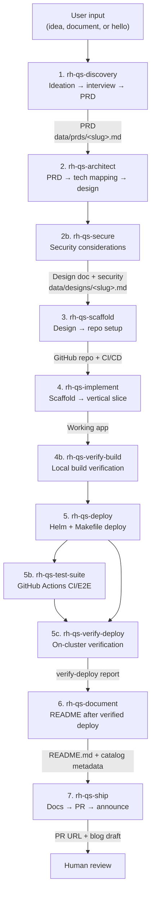

# New Quickstart Skills 

# Goal
The greenfield skills pipeline flow is a set of skills executed in a particular order, with the goal of creating a totally new AI Quickstart

# What skills make up this flow?

| Stage | Skill | Output | Location |
|-------|-------|--------|----------|
| 1 | rh-qs-discovery | `data/prds/<slug>.md` | `core/skills/rh-qs-discovery/` |
| 2 | rh-qs-architect | `data/designs/<slug>.md` | `core/skills/rh-qs-architect/` |
| 2b | rh-qs-secure | Security section in design doc | `core/skills/rh-qs-secure/` |
| 3 | rh-qs-scaffold | GitHub repo + CI/CD | `core/skills/rh-qs-scaffold/` |
| 4 | rh-qs-implement | Working application code | `core/skills/rh-qs-implement/` |
| 4b | rh-qs-verify-build | Local build verified | `core/skills/rh-qs-verify-build/` |
| 5 | rh-qs-deploy | Helm chart + compose.yml | `core/skills/rh-qs-deploy/` |
| 5b | rh-qs-test-suite | GitHub Actions (PR/E2E/nightly) | `core/skills/rh-qs-test-suite/` |
| 5c | rh-qs-verify-deploy | `data/reports/verify-deploy-*.md` | `core/skills/rh-qs-verify-deploy/` |
| 6 | rh-qs-document | README.md + docs/ | `core/skills/rh-qs-document/` |
| 7 | rh-qs-ship | PR URL + blog draft | `core/skills/rh-qs-ship/` |

**Maintenance (any time):** `rh-qs-bump-versions` — dependency and chart version updates.

# Flow

When using the skills please start with the `rh-qs-discovery` and the skills will lead you to the next step in the process.
Some steps like 1–3 need to be done in order because the data needs to be in place before the next skill runs.

**Documentation comes after deploy verification** — do not run `rh-qs-document` until `rh-qs-verify-deploy` passes.

**Cluster access:** agents use Helm/Makefile only — no raw `oc`/`kubectl`. See `rh-qs-secure`.
