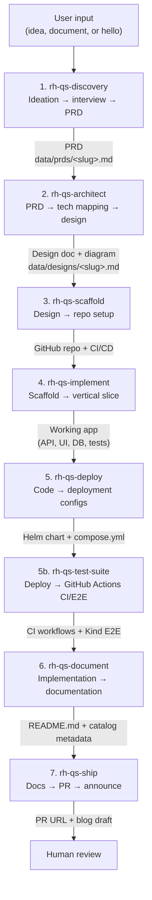

# New Quickstart Skills 

# Goal
The greenfield skills pipeline flow is a set of skills executed in a particular order, with the goal of creating a totally new AI Quickstart

# What skills make up this flow?

| Stage | Skill            | Output                          | Location                                    |
|-------|------------------|---------------------------------|---------------------------------------------|
| 1     | rh-qs-discovery  | `data/prds/<slug>.md`           | `core/skills/rh-qs-discovery/`              |
| 2     | rh-qs-architect  | `data/designs/<slug>.md`        | `core/skills/rh-qs-architect/`              |
| 3     | rh-qs-scaffold   | GitHub repo + CI/CD             | `core/skills/rh-qs-scaffold/`               |
| 4     | rh-qs-implement  | Working application code        | `core/skills/rh-qs-implement/`              |
| 5     | rh-qs-deploy     | Helm chart + compose.yml        | `core/skills/rh-qs-deploy/`                 |
| 5b    | rh-qs-test-suite | GitHub Actions (PR/E2E/nightly) | `core/skills/rh-qs-test-suite/`             |
| 6     | rh-qs-document   | README.md + docs/               | `core/skills/rh-qs-document/`               |
| 7     | rh-qs-ship       | PR URL + blog draft             | `core/skills/rh-qs-ship/`                   |

# Flow

When using the skills please start with the `rh-qs-discovery` and the skills will lead you to the next step in the process.
Some steps like 1-3 need to be done in order because the data needs to be in place before the next skill runs.

