# Quickstart Factory — Walkthrough

Step-by-step screenshots showing the full workflow: from opening the project to generating a blog post draft for a quickstart with a linked implementation.

---

## 1. Open the project

Open `quickstart-factory` in Cursor (or any supported AI client) and launch the terminal with Claude Code.

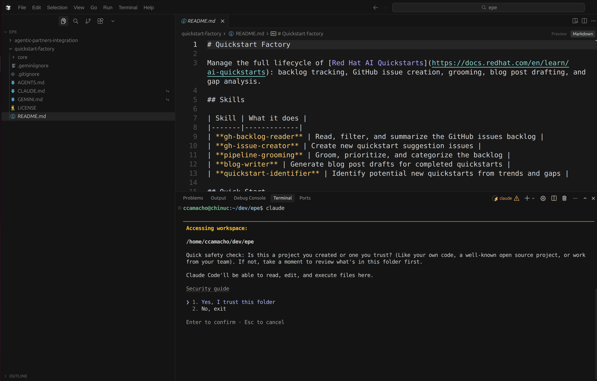

---

## 2. Claude reads the governance

Claude automatically reads `AGENTS.md` and loads the project rules, skills, and session start protocol.

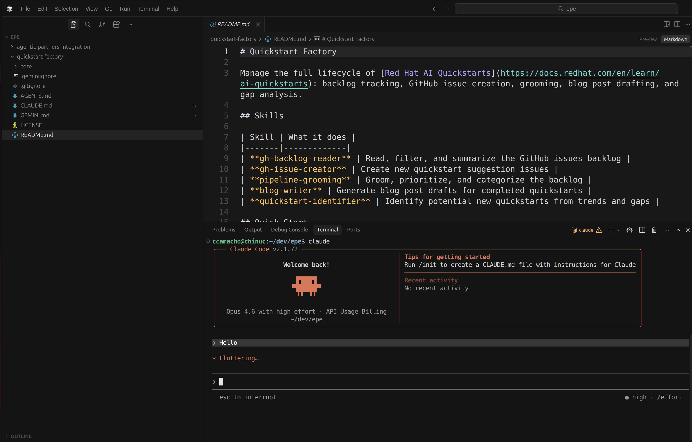

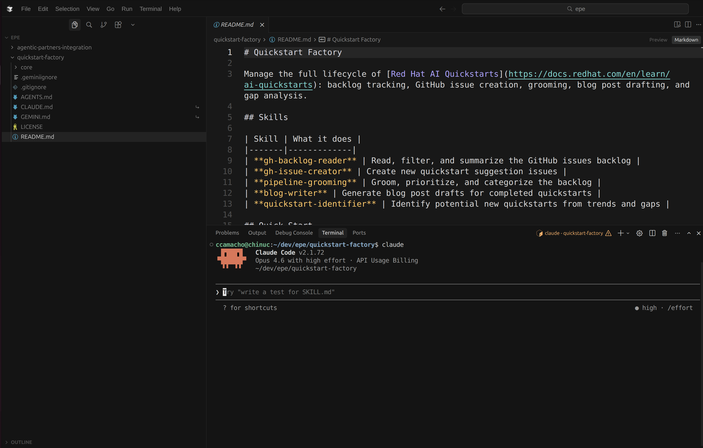

---

## 3. Say hello

Type **"hello"** to trigger the session start protocol. Claude syncs skills and fetches the live backlog from GitHub.

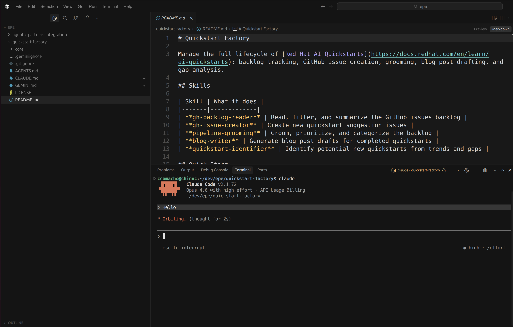

---

## 4. Skills auto-sync

On first run, skills are automatically synced as symlinks to the AI client directory. This happens silently — no manual setup needed.

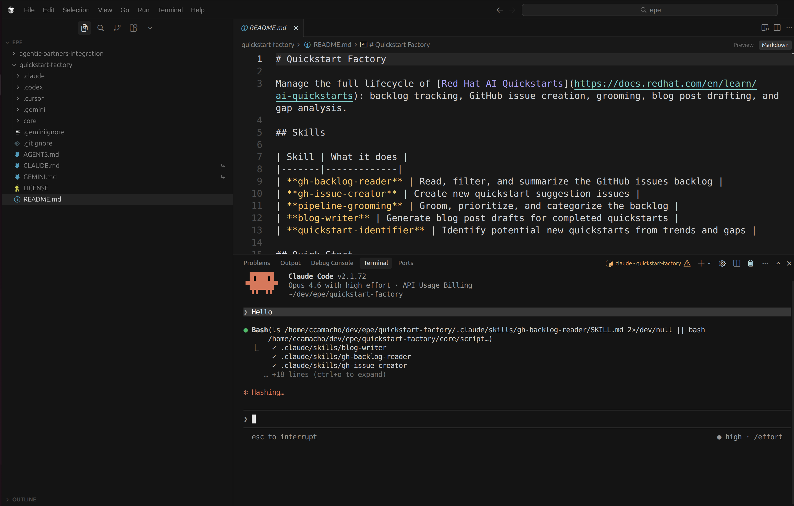

---

## 5. Dashboard

Claude presents the backlog dashboard: open issue count, breakdown by label and assignee, and an action menu.

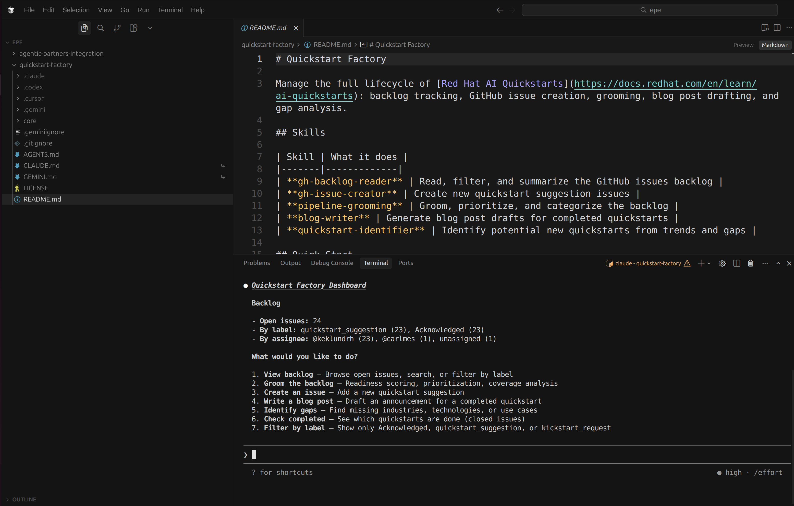

---

## 6. Query issues by author

Ask for issues by a specific user. Claude runs `gh-backlog-reader --author <username>` and presents the results as a table.

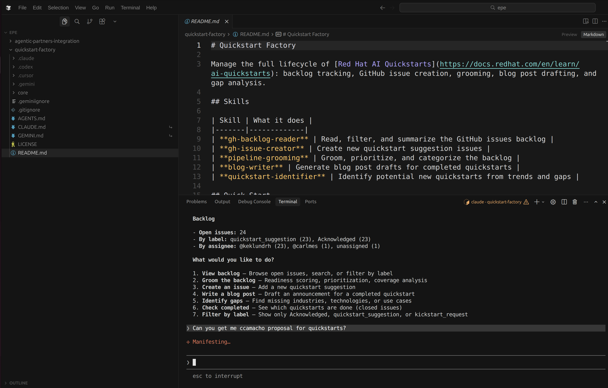

---

## 7. Issue results

The matching issues are displayed with issue number, title, labels, author, assignees, and creation date.

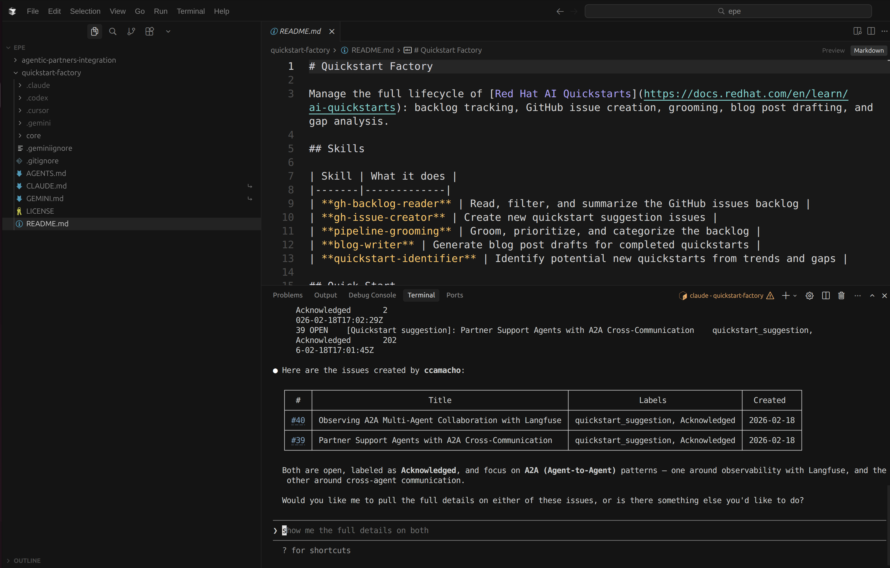

---

## 8. Drill into an issue

Ask for details on a specific issue. Claude runs `gh-backlog-reader --issue <N>` which fetches the full description, all comments, and automatically extracts linked repositories.

---

## 9. Linked implementation detected

The issue comments contain a link to the implementation repository. Claude surfaces this under **Linked Implementation** and offers next actions: write a blog post, view related issues, or browse the implementation repo.

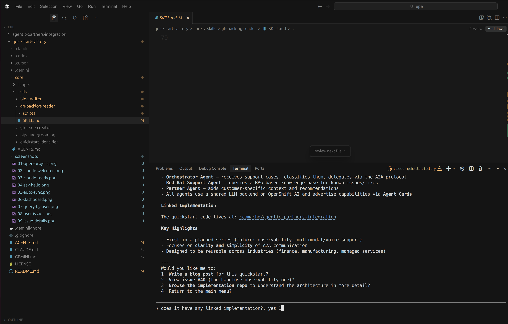

---

## 10. Reading the implementation

When asked to write a blog post, Claude reads the `blog-writer` skill guidelines, fetches the linked repo's README via the GitHub API, and gathers the full technical context before drafting.

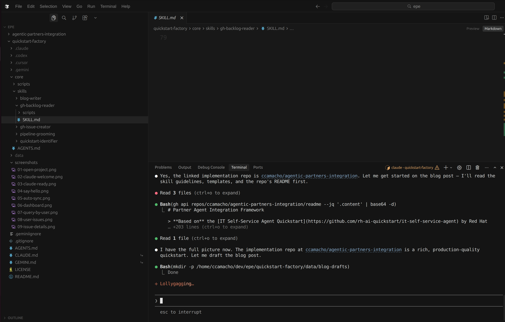

---

## 11. Blog post draft created

Claude generates a blog post draft and writes it to `data/blog-drafts/`. The diff view shows the content being created — title, hook, architecture overview, and getting-started instructions — all sourced from the issue and its linked implementation.

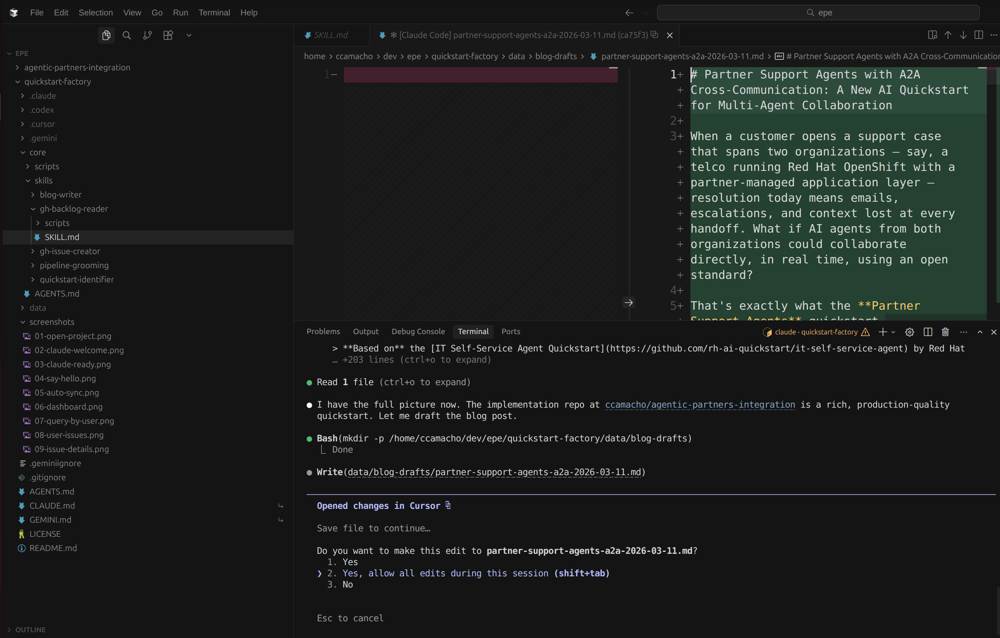

---

## 12. Blog draft complete

The finished draft is saved as a markdown file (e.g. `partner-support-agents-a2a-2026-03-11.md`). The `data/` directory is gitignored, so drafts stay local until you're ready to publish.

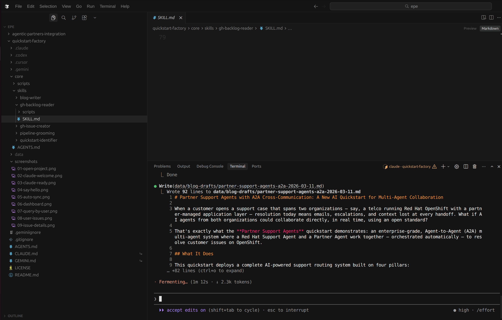
